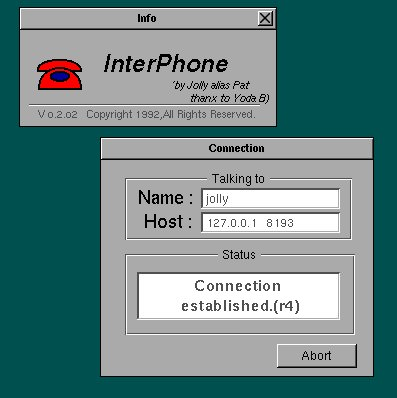

# InterPhone 0.2.03

Historical import reconstructed from the old projects index.

## Details
- Year: 1991
- Environment: NextStep
- Status: Experimental

## Description
InterPhone is a program to use the (local) network as a telephone system. You can talk
to other people that are running InterPhone like on a phone.

InterPhone is not stable and is only a demonstration of what technologies could
arrise on the internet.

## Original Materials
- Extracted from `1991.InterPhone.0.2.03.I.bs.tar.gz` into `1991.InterPhone.0.2.03.I.bs/`
- Included original file `1991.InterPhone.icon.jpg`
- Included original file `1991.InterPhone.screen.jpg`

## Images
### Icon

### Screenshot

